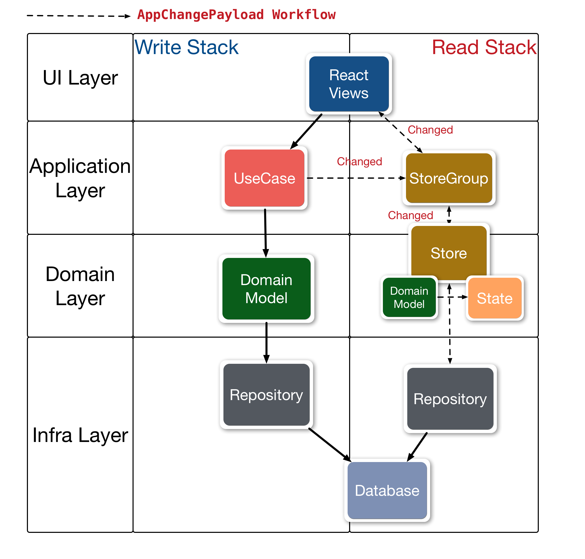

# almin-cqrs-example

Almin + CQRS example

## WorkFlow

### Write

1. The user execute a UseCase from View
2. Get the Domain model from Repository
3. The Domain model do work about the UseCase
4. Finally, Save the Domain model to Repository

### Read

1. Sometimes, The UseCase notify that "State is change. Maybe".
2. The View get State from Store
3. Store get the Domain model from Repository
4. Just in time, Store convert the Domain model to the State.
6. Render the view with the state.

### AppChangePayload Workflow

**Do** by Application
**Delegate** by Almin

- [Do] User do UseCase#dispatch [AppUseCase]
- [Delegate] UseCaseExecutor: pipe to dispatcher
- [Delegate] Context: pipe to StoreGroup
- [Delegate] StoreGroup] pipe to *Store*s
- [Do] Store#onDispatch -> Store#emitChange [AppStoreGroup]
- [Delegate] StoreGroup#onChange -> Context#onChange
- [Do] Context#onChange -> User Do

### Logging

- UseCase is changed -> log
- Context#onChange is called -> log

## Usage

    npm install
    npm start
    # open http://localhost:8080

## Changelog

See [Releases page](https://github.com/azu/almin-cqrs-example/releases).

## Running tests

Install devDependencies and Run `npm test`:

    npm i -d && npm test

## Contributing

Pull requests and stars are always welcome.

For bugs and feature requests, [please create an issue](https://github.com/azu/almin-cqrs-example/issues).

1. Fork it!
2. Create your feature branch: `git checkout -b my-new-feature`
3. Commit your changes: `git commit -am 'Add some feature'`
4. Push to the branch: `git push origin my-new-feature`
5. Submit a pull request :D

## Author

- [github/azu](https://github.com/azu)
- [twitter/azu_re](https://twitter.com/azu_re)

## License

MIT © azu
